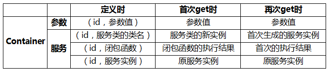

# Soil\Container

Container容器（也被称为服务容器，Service Container），是整个系统最核心、最常用的部分。Container本质上可以视为一个大数组，这个数组用id-value的形式存储参数条目和服务条目，供整个系统共享。

* Container的id必须是非空字符串，且大小写敏感。
* Container的value有两种类型：一种是参数型（parameter），一种是服务型（service）。参数型的条目一般储存配置信息，服务型的条目储存的是服务对象。
* 而服务型的条目，在设置时又可以分为三种：类名字符串、闭包函数、服务实例。




## 参数型条目

参数型条目主要用于保存配置信息：

#### 用法：

```php
set(参数的id，参数的值)        // 把一个参数绑定到容器
get(参数的id)                  // 取回此参数值
```

#### 代码：

```php
$container = new Soil\Container;

// 用数组形式设置 $container['foo']=bar
$container['db.host']   = 'localhost';
$container['db.driver'] = 'mysql';

// 用对象形式设置 $container->set('foo', bar)
$container->set('db.host',   'localhost');
$container->set('db.driver', 'mysql');

// 用数组形式取回
$a = $container['db.host'];     // $a='localhost'
$b = $container['db.driver'];   // $b='mysql'

// 用对象形式取回
$a = $container->get('db.host');     // $a='localhost'
$b = $container->get('db.driver');   // $b='mysql'
```

## 服务型条目

对象型条目主要用于保存服务对象定义，保存服务对象实例。

#### 用法：

```php
bind(服务的id, 服务的定义);       // 把一个服务绑定到容器
get(服务的id);                    // 获取服务的实例
```

其中，`服务的定义`在bind时可以有三种类型：

* 以类名方式：`\Your\Class\Name`
* 以闭包方式：`function(..){...}`
* 以实例方式：`已经new好的服务实例`

首次get时，

1. 对于以类名绑定的，生成绑定的类名的一个 **新的实例对象**。
2. 对于以闭包绑定的，执行一次绑定的闭包函数，返回 **新的执行结果**。
3. 对于以实例绑定的，仍然返回绑定时的实例对象。

再次get时：

1. 对于以类名绑定的，返回首次生成的实例。
2. 对于以闭包绑定的，返回首次的执行结果。
3. 对于以实例绑定的，仍然返回绑定时的实例对象。


#### 示例代码如下：

注册时：

```php
$container = new Soil\Container;

// 以类名绑定
$container->bind('foo', '\\Your\\Class\\Name');  // 用类名字符串的形式bind一个服务到容器

// 以闭包绑定
$container->bind('bar', function(...){...});     // 用闭包函数的形式bind一个服务到容器

// 以实例绑定
$svc = new YourSerive;
$container->bind('kow', $svc);                   // 用服务实例的形式bind一个服务到容器
```

返回时：

```php
$foo1 = $container['foo']; // 第一次时，$foo1 = new \Your\Class\Name;
$foo2 = $container['foo']; // 第二次时，$foo2 = $foo1
$foo3 = $container['foo']; // 第三次时，$foo3 = $foo1
```

## 代码示例

### 1. 绑定类名的测试

```php
<?php
// 这个一个简单的测试类，每次初始化时，生成一个随机数
class Foo {
    public $num;
    public function __construct() {
        $this->num = rand(1, 100);
    }
}

require(__DIR__ . '/../soil/src/Container.php');

$container = new Soil\Container;

// 绑定为类名
$container->bind('aaa', 'Foo');

$a1 = $container['aaa'];
echo PHP_EOL . $a1->num;    // 90   <--第一次get生成
$a2 = $container['aaa'];
echo PHP_EOL . $a2->num;    // 90   <--还是第一次生成的那个
```

### 2. 绑定闭包的测试

```php
<?php
// 这个一个简单的测试类
class Foo {
    public $num;
    public function __construct(){
        $this->num = rand(1, 100);
    }
}

require(__DIR__ . '/../soil/src/Container.php');

$container = new Soil\Container;

// 绑定为闭包函数
$container->bind('aaa', function() {
    return new Foo;
});

$a1 = $container['aaa'];
echo PHP_EOL . $a1->num;    // 61 <- 第一次get生成
$a2 = $container['aaa'];
echo PHP_EOL . $a2->num;    // 61 <- 第二次还是得到第一次生成的那个
```

### 3. 绑定实例的测试

```php
<?php
// 这个一个简单的测试类
class Foo {
    public $num;
    public function __construct(){
        $this->num = rand(1, 100);
    }
}

require(__DIR__ . '/../soil/src/Container.php');

$container = new Soil\Container;

$foo = new Foo();  // 生成服务实例
echo PHP_EOL . $foo->num;   // 74

// 绑定为实例
$container->bind('aaa', $foo);

$a1 = $container['aaa'];
echo PHP_EOL . $a1->num;    // 74   <--就是$foo
$a2 = $container['aaa'];
echo PHP_EOL . $a2->num;    // 74   <--就是$foo
```


--------
参见 <https://github.com/maccliu/soil>